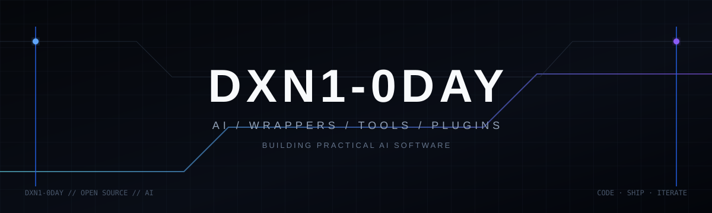

### AI wrappers · AI tools · AI plugins

Building practical AI software, integrations, and developer tooling.

---

## `whoami`

I'm **DXN1-0DAY**, an independent developer focused on AI wrappers, AI tools, AI plugins, integrations, and the infrastructure around them.

I like software that is **useful, lightweight, modular, and actually shippable**. A lot of the work starts as a rough idea and ends up as a tool, wrapper, plugin, or system that can be reused elsewhere.

## What I'm building

| Area | Focus |
| --- | --- |
| **AI wrappers** | Clean interfaces around models and AI services, with practical integrations. |
| **AI tools** | Utilities and developer tools that make AI systems easier to use and extend. |
| **AI plugins** | Plugins and connectors that give AI access to useful capabilities. |
| **Sonder / sonderr-v1** | A compact AI assistant built around tools, retrieval, memory, and web search. |
| **AnyClaw / agent tooling** | Experiments in agents, orchestration, automation, and tool use. |

## Stack

## Approach

> Build the wrapper. Connect the tool. Make the system useful.

I care about turning ideas into working software, keeping components reusable, and improving projects through iteration instead of piling on unnecessary complexity.

## Connect

[GitHub](https://github.com/DXN1-0DAY) · [Discord DM](https://discord.gg/wEz5j8VC)

---

`DXN1-0DAY` · AI tooling in progress

